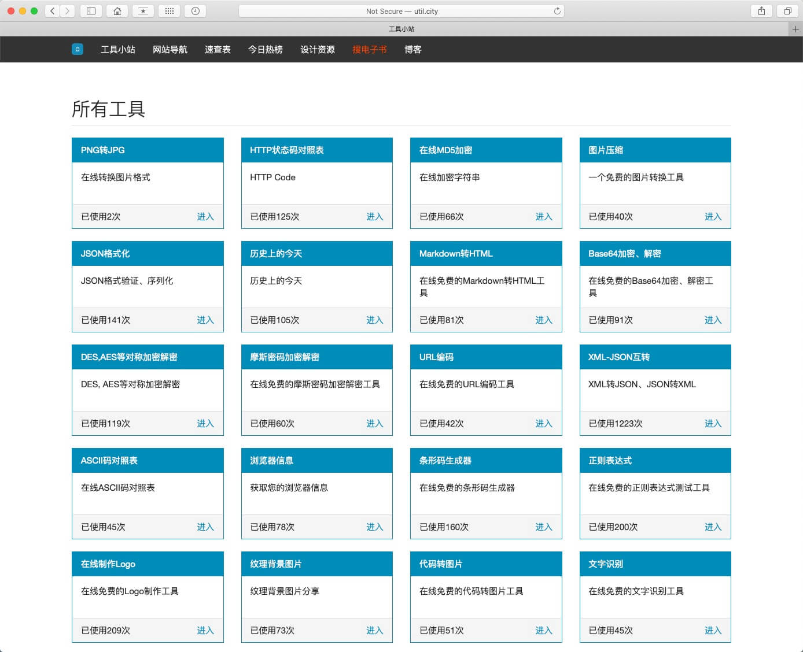
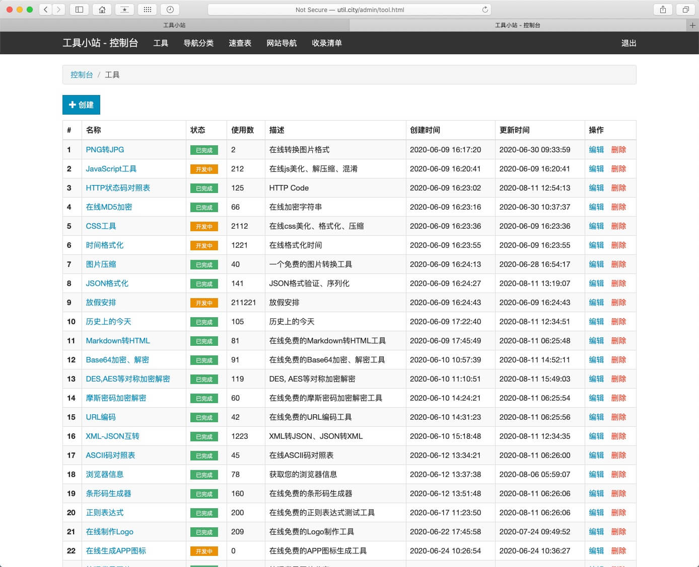

# 工具小站

收录了一些免费的工具(包含简单的后台管理系统), [在线体验](http://util.city/)

预览: 




工具清单:
+ PNG转JPG
+ HTTP状态码对照表
+ 在线MD5加密
+ 图片压缩
+ JSON格式化
+ 历史上的今天
+ Markdown转HTML
+ Base64加密、解密
+ DES,AES等对称加密解密
+ 摩斯密码加密解密
+ URL编码
+ XML-JSON互转
+ ASCII码对照表
+ 浏览器信息
+ 条形码生成器
+ 正则表达式
+ 在线制作Logo
+ 纹理背景图片
+ 代码转图片
+ 文字识别
+ GitHub Trending
+ 图片转字符画
+ 搜电子书
+ 网站导航
+ 速查表
+ 今日热榜
+ 设计资源

TODO:
+ JavaScript工具
+ CSS工具
+ 时间格式化
+ 放假安排

### Prerequisites
+ 后端使用的 Node 框架 [Egg](https://eggjs.org/), 您需要具备 node 环境
+ 数据库使用的 mysql, 您需要具备 mysql 环境

### Installing

```bash
# 下载代码
git clone https://github.com/rmlzy/tools.git
cd tools

# 安装依赖
npm install
```

```bash
# 创建本地配置
cp config/config.local.js.sample config/config.local.js
```

## Deployment

可以参考 `deploy.sh.sample`

## Built With

* [egg](https://eggjs.org/) - Node 框架
* [bootstrap](https://getbootstrap.com/docs/3.4/) - UI 库
* [sequelize](https://sequelize.org//) - MySQL ORM
* [layer](https://layer.layui.com/?alone) - 页面弹窗

## Authors

[Jason Liu](http://poppython.com/)

意见反馈、技术支持可以随时联系我, 或者提 [ISSUE](https://github.com/rmlzy/tools/issues)。

## LICENSE

MIT
